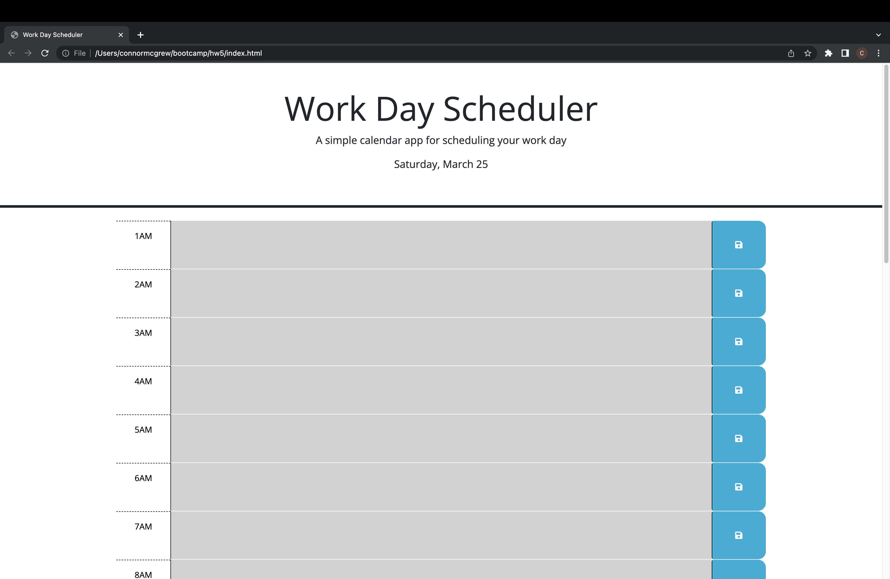

# Work Day Scheduler 
  
  ## Table of Contents
  * [Description](#description)
  * [Installation](#installation)
  * [Usage](#usage)
  * [Licenses](#licenses)
  * [Questions](#questions)

  ## Description 
    This is a daily calander. Click on a time where you want to add an event, then click save. Once you save the page can be refreshed and the even will still be there.
  

## Installation 
N/A
## Usage 
This is a webpage, to use follow the pages link
## Licenses 
  ## Licenses
    This project is covered under the MIT license. To learn more about what this means, click the license button at the top.
## Questions 
Any questions about the project?
Github: https://github.com/connormcgrew
Email: connormcgrew003@gmail.com
